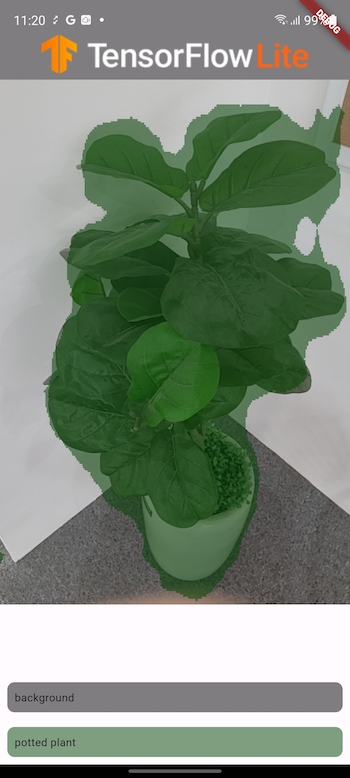
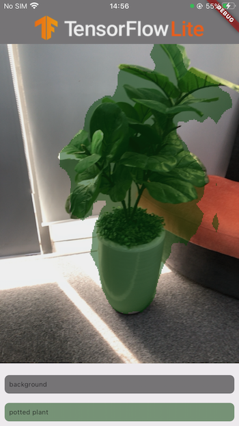

# ict3217_image_segmentation

|      | Android | iOS | Linux | Mac | Windows | Web |
|------|---------|-----|-------|-----|---------|-----|
| live | ✅       | ✅   |       |    |         |     |

This project is a sample of how to perform Image Segmentation using
TensorFlow Lite in Flutter. It includes support for both Android and IOS.

## (Important) Initial setup : Add dynamic libraries to your app

### Android & iOS

Examples and support now support dynamic library downloads! iOS samples can be run with the commands

`flutter build ios` & `flutter install ios` from their respective iOS folders.

Android can be run with the commands

`flutter build android` & `flutter install android`

while devices are plugged in.

Note: This requires a device with a minimum API level of 26.

Note: TFLite may not work in the iOS simulator. It's recommended that you test with a physical device.

When creating a release archive (IPA), the symbols are stripped by Xcode, so the command `flutter build ipa` may throw a `Failed to lookup symbol ... symbol not found` error. To work around this:

1. In Xcode, go to **Target Runner > Build Settings > Strip Style**
2. Change from **All Symbols** to **Non-Global Symbols**

Note: If the app needs a refresh or restart, run comannds 
`flutter clean` & `flutter pub get` & `flutter run` from their respective folders

### Download model and labels

To build the project, you must enusre you have the Deeplab V3 (or any) TensorFlow Lite
model and its corresponding labels under assets.

Alternatively, you can download our models, Windows can be run with the commands

`models.bat`

While Linux and MacOS can be run with the commands

`chmod +x models.sh` & `./models.sh`

### About the sample

- You can use Flutter-supported IDEs such as Android Studio or Visual Studio.
  This project has been tested on Android Studio Flamingo.
- Before building, ensure that you have downloaded the model and the labels by
  following a set of instructions.

## Screenshots
### Android

### IOS

